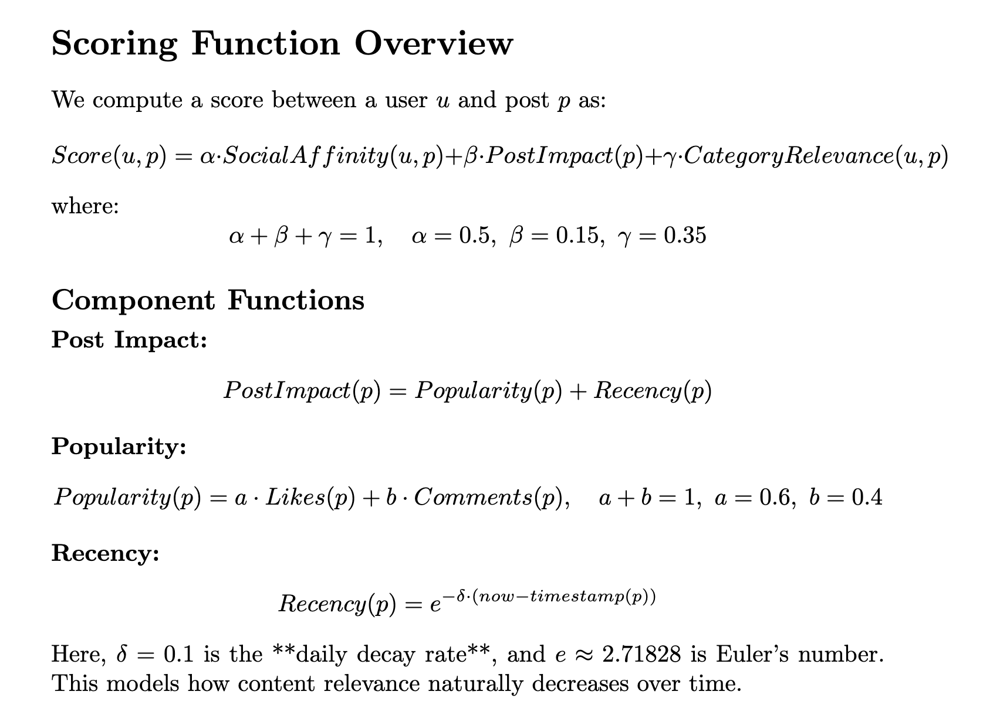
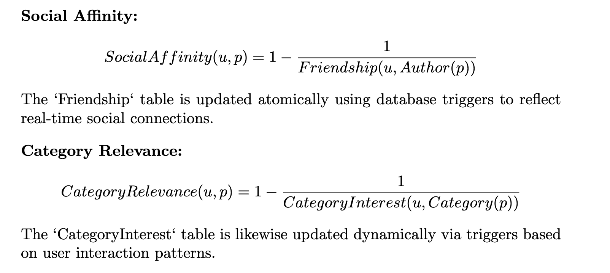
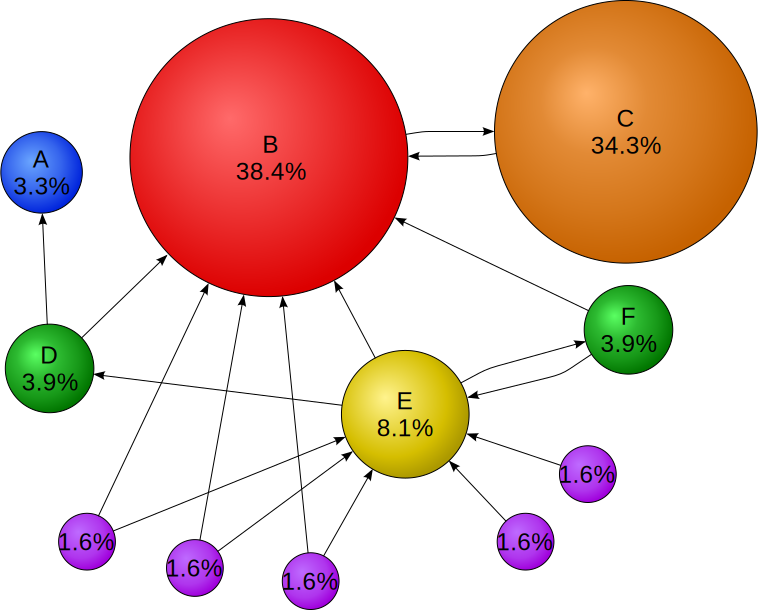

# Annatoria

## Overview

Annatoria is a web application for managing and sharing multimedia content, focusing on annotation, organization, and statistical analysis. It is inspired by platforms like Instagram and Unsplash, allowing users to upload images and videos, annotate them with metadata, organize content, view statistics, and engage socially through likes and comments.

## Feed algorithm

Implemented PageRank on an Undirected Graph Algorithm developed by Google. We generate posts as nodes with the purpose of "measuring" its relative importance within the set. An edge to a post counts as a vote of support. The PageRank of a post is defined recursively and depends on the number and PageRank metric of all pages that link to it ("incoming edges"). A post that is linked to by many posts with high PageRank receives a high rank itself. 2 posts have an edge between them if they have the same category or are posted by the same author.

So, our iterative way sounds like this: (**pages** = **posts**)

At **t = 0** an initial probability is assumed:

where user is the user that's calling the algorithm and p**i** is post i. 0 is page i at time 0 and **Score(u, p)** is definedat the bottom.

d = usually 0.85 (probability to stop scrolling)
N = number of posts
L(p**j**) = number of edges linked to post **j**
M(p**i**) = Set of posts that are linked to post **i**

The algorithm iterates over all nodes of the graph until

epsilon - small constant
for all i.

PageRank: **https://en.wikipedia.org/wiki/PageRank**

## Features

- **Account Management**: Create accounts, log in, and delete accounts with authentication.
- **Multimedia Upload**: Upload images and videos (JPG, PNG, MP4, AVI) with a 50MB file size limit.
- **Content Annotation**: Add descriptions, categories, creation years, and up to 50 tags per post.
- **Personalized Feed**: View content based on user preferences and likes, with sorting and filtering.
- **Social Interaction**: Like and comment on posts, and view other users' profiles.
- **Statistics Dashboard**: View insights on liked and commented posts, active users, and export data in CSV and SVG formats.
- **RSS Feed**: Generate feeds for news and trends.

## System Requirements

### Functional Requirements

- **AUTH Module**:
  - **Account Creation**: Create accounts with unique username and valid email (High Priority)
  - **Login**: Authenticate with username and password (High Priority)
  - **Account Deletion**: Delete accounts with confirmation and data removal (Medium Priority)
- **POSTS Module**:
  - **Multimedia Upload**: Upload files with format and size validation (High Priority)
  - **Post Annotation**: Add metadata to posts (High Priority)
  - **Import/Export Favorite Posts**: Support JSON and XML formats (Low Priority)
- **FEED Module**:
  - **Personalized Feed**: Generate feed based on like history (High Priority)
  - **Sorting and Filtering**: Sort by category, year, and tags (High Priority)
  - **Social Interaction**: Like and comment on posts (High Priority)
  - **Profile Viewing**: Visit other users' profiles (Medium Priority)
- **STATISTICS Module**:
  - **Liked Posts Statistics**: Display most liked post (Medium Priority)
  - **Category Statistics**: Display most commented post and active user (Medium Priority)
  - **Data Export**: Export statistics in CSV and SVG formats (Medium Priority)
  - **RSS Feed**: Generate feed for updates (Low Priority)

### Design Constraints

- **Technologies**:
  - **Backend**: Java Servlets, JSP
  - **Frontend**: HTML5, CSS3, JavaScript
  - **Database**: ORACLE 23ai
  - **Server**: Apache Tomcat
- **Security**:
  - Validate all user inputs
  - Use session-based authentication
  - Implement CSRF protection
  - Validate file uploads
- **Standards**:
  - Comply with W3C standards
  - Follow accessibility guidelines
  - Ensure responsive design
  - Support cross-browser compatibility (Chrome, Firefox, Safari, Edge)

## Usage

- **Sign Up/Login**: Create or log in to an account.
- **Upload Content**: Add images or videos and annotate with metadata.
- **Explore Feed**: Browse, like, comment, and filter content.
- **View Statistics**: Access insights and export data.
- **Manage Profile**: Update profile and view posts.

## Contributing

Developed by Popa David-Tudor and Iancu Stefan-Teodor for academic purposes. Submit pull requests or open issues for suggestions.

## License

For academic use only, not licensed for commercial purposes.

## Document Information

- **Version**: 1.0
- **Date**: June 2025
- **Status**: BETA

**Classification**: Academic Project

## Youtube presentation
https://youtu.be/0NQ1iITPIXU
